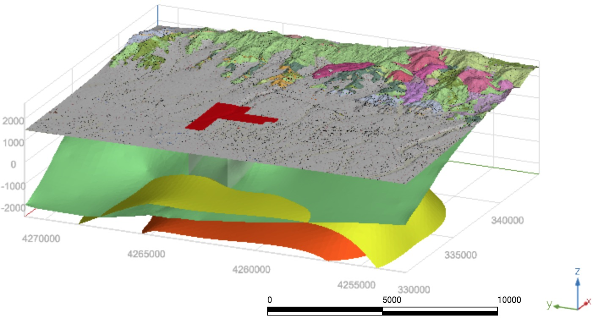

# 地学数据三维可视化简介

## 本课程内容

- 地学数据三维可视化简介
- 科学可视化工具简介
- 基于Madagascar的地学数据三维可视化；
- 基于VisPy的地震数据可视化；
- 基于PyVista的多地球物理数据可视化；
- 基于vedo的地热场三维可视化；
- 基于Mayavi的地学数据三维可视化；
- 基于ParaView的地学数据三维可视化。

## 本课程目标

- 了解地学数据三维可视化的基本概念；
- 掌握一些基于开源可视化工具的地学数据可视化方法；
- 能够独立实现地学数据的三维可视化；
- 简单掌握Linux、Jupyter Notebook、Madagascar等工具。

## 什么是可视化

“The purpose of computing is insight not numbers.” 

-- R. W. Hamming (1961) 

可视化的首要目标是洞察数据所表达的信息，它将多重属性的信息和多维度的数据以图、表、符号等直观的方式呈现出来；可视化需要一系列软硬件的支撑，如GPU和高分辨率显示器、可视化软件、数据库技术、高速网络等。可视化一般可分为信息可视化和科学可视化。

- 信息可视化（InfoVis）
    - 多属性对象描述，如岩石矿物的岩性、颜色、结构等；
    - 统计学信息，如疫情分布、天然地震数据统计等。

- 科学可视化（SciVis）
    - 三维空间的物理量，如地下介质的速度和密度分布等；
    - 三维几何形态的物体，如飞机、建筑物、蛋白质分子结构等；
    - 时空物理场，如电磁场、地震波场等。

## 科学可视化

- 科学可视化是科学之中的一个跨学科研究与应用领域，主要关注的是三维现象的可视化，如建筑学、气象学、医学或生物学方面的各种系统。重点在于对体、面以及光源等等的逼真渲染，或许甚至还包括某种动态（时间）成分。

- 科学可视化本身并不是最终目的，而是许多科学技术工作的一个构成要素。这些工作之中通常会包括对于科学技术数据和模型的解释、操作与处理。科学工作者对数据加以可视化，旨在寻找其中的种种模式、特点、关系以及异常情况；换句话说，也就是为了帮助理解。因此，应当把可视化看作是任务驱动型，而不是数据驱动型。

## 什么是地学数据三维可视化

- 地学数据通常是由三维空间中的介质参数（如地震速度、密度、电导率、磁导率、孔隙度、矿物含量等）和物理观测数据（重磁电震剖面、测井曲线、岩芯等）组成，因此地学数据三维可视化也是科学数据可视化的一种应用方向；

- 地学数据三维可视化技术可让我们直观、清晰、全面地了解地学数据及其空间分布特征，有助于我们探索观测数据与介质参数分布之间的关系，从而为数据解释、项目决策、风险评估等提供可靠依据。
