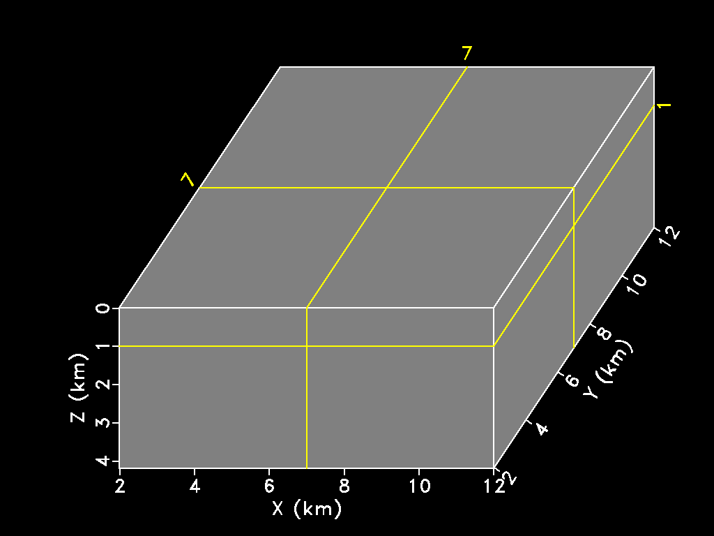

# 基于Madagascar的地学数据三维可视化

## 开源研究

- “Abandoning the habit of secrecy in favor of process transparency and peer review was the crucial step by which alchemy became chemistry. In the same way, it is beginning to appear that open-source development may signal the long-awaited maturation of software development as a discipline.”   -- Eric Raymond

- “An article about computational science in a scientific publication is not the scholarship itself, it is merely advertising of the scholarship. The actual scholarship is the complete software development environment and the complete set of instructions which generated the figures.”   -- Jon Claerbout

- “We want ideas, and in particular programs, that work in one place to work elsewhere. One form of objectivity is that published science must work elsewhere than just in the author's laboratory or even just in the author's imagination; this requirement is called reproducibility.”    -- Harold Thimbleby

- “Scientific computation is emerging as absolutely central to the scientific method, but the prevalence of very relaxed practices is leading to a credibility crisis. Reproducible computational research, in which all details of computations—code and data—are made conveniently available to others, is a necessary response to this crisis. The authors review their approach to reproducible research and describe how it has evolved over time, discussing the arguments for and against working reproducibly.”    -- David L. Donoho

- “Despite our poor ability to get new adherents to the philosophy of reproducible research, we continued producing maybe 800 pages a year of documents in signal and image processing, steadily honing our skills at doing so. Although I always made the claim (which was true) that reproducibility was essential to pass wisdom on to the next generation, our experience was always that the most likely recipient would be the author herself at a later stage of life.”   -- Sergey Fomel

## Madagascar

[**Madagascar**](https://www.reproducibility.org/wiki/Main_Page) is an open-source software package for multidimensional data analysis and reproducible computational experiments. Its mission is to provide

- a convenient and powerful environment
- a convenient technology transfer tool

for researchers working with digital image and data processing in geophysics and related fields. Technology developed using the Madagascar project management system is transferred in the form of recorded processing histories, which become "computational recipes" to be verified, exchanged, and modified by users of the system.

Install Madagascar with few steps, advanced installation with platform-specific installation advice can ben found [here](https://www.reproducibility.org/wiki/Advanced_Installation#Platform-specific_installation_advice):

- `git clone https://github.com/ahay/src RSFSRC`
- `./configure --prefix=$RSFROOT`
- `make install`
- `source ~/RSFSRC/env.sh`
- `export DATAPATH=~/RSFDATA/`

## Madagascar三维可视化

**sfgrey3** generates “cube” plots from 3-D data. Some of the options specific to this kind of display are:
    
- flat=y/n The flat parameter tells sfgrey3 whether to display the cube as a flat image or in a 3-D projection.
- frame1=, frame2=, frame3= The frame parameters select the slices from the cube to be displayed in the plot.
- point1=, point2= The point1= and point2= parameters control the aspect ratio of the cube in the vertical and the horizontal dimension, respectively.
- movie=y/n The movie parameter allows the user to create a movie looping over slices in a cube instead of a static picture.
